# 🏗️ Building Evaluation and Project Prioritization System

This project develops a web system to **automate the evaluation of buildings** at the Costa Rica Institute of Technology (TEC) and support the **prioritization of maintenance, remodeling, or construction projects**.  

The system replaces manual processes (based on scattered spreadsheets), improving **efficiency, traceability, and strategic decision-making**.

---

## 🚀 Main Features

- **Building evaluations**: structured records of technical conditions, depreciation, and serviceability.  
- **Project prioritization**: automatic ranking based on urgency, impact, and estimated costs.  
- **User and role management**: secure access control through institutional authentication.  
- **Report generation**: export structured data and charts to PDF and Excel.  
- **Evaluation history**: review previous evaluations for each building.  
- **Intuitive interface**: accessible design, real-time validations, and compliance with WCAG 2.1 AA accessibility standards.  

---

## 🛠️ Technologies Used

- **Frontend**: [Next.js 14](https://nextjs.org/) + TailwindCSS  
- **Backend**: Serverless API on Vercel  
- **Database**: PostgreSQL on [Supabase](https://supabase.com/)  and MongoDB on [MongoAtlas](https://www.mongodb.com/products/platform)
- **Authentication and roles**: [Clerk](https://clerk.com/)  
- **File storage**: [UploadThing](https://uploadthing.com/)  
- **Hosting**: [Vercel](https://vercel.com/)  

---

## 📐 System Architecture

```mermaid
flowchart TD
    U[👤 User] -->|Web| FE[Next.js Frontend]
    FE -->|API Calls| BE[Backend on Vercel]
    BE -->|Auth| Clerk[Clerk]
    BE -->|Data| DB[(Supabase - PostgreSQL / MongoAtlas - MongoDB)]
    BE -->|Files| UT[UploadThing]
    DB -->|Reports| EX[📊 Export PDF/Excel]
```



## 👥 User Roles

    Administrator: manages users, assigns roles, and configures parameters.

    Project Evaluator: records evaluations and prioritizes projects.


## 📋 Requirements
  - Node.js 20+
  - Supabase account
  - Vercel account
  - Clerk API keys
  - UploadThing API keys
  - MongoAtlas API keys

## ⚙️ Installation & Usage
    Clone the repository:
```sh
    git clone https://github.com/yourusername/building-evaluation.git
    cd building-evaluation
```
Install dependencies:
```sh
    npm/pnpm/bun install
```
Configure environment variables (.env.local):
```
    NEXT_PUBLIC_SUPABASE_URL=...
    NEXT_PUBLIC_SUPABASE_ANON_KEY=...
    CLERK_API_KEY=...
    UPLOADTHING_API_KEY=...
```
Run in development mode:
```sh
    npm/pnpm/bun run dev
```
Open in your browser:
```
    http://localhost:3000
```
## 👨‍💻 Development Team

| Member |
|--------|
| [](https://github.com/javialroro) |
| [](https://github.com/HytanJara) |
| [](https://github.com/Julianlopmm) |
| [](https://github.com/ScarloVM) |


Costa Rica Institute of Technology – 2025
